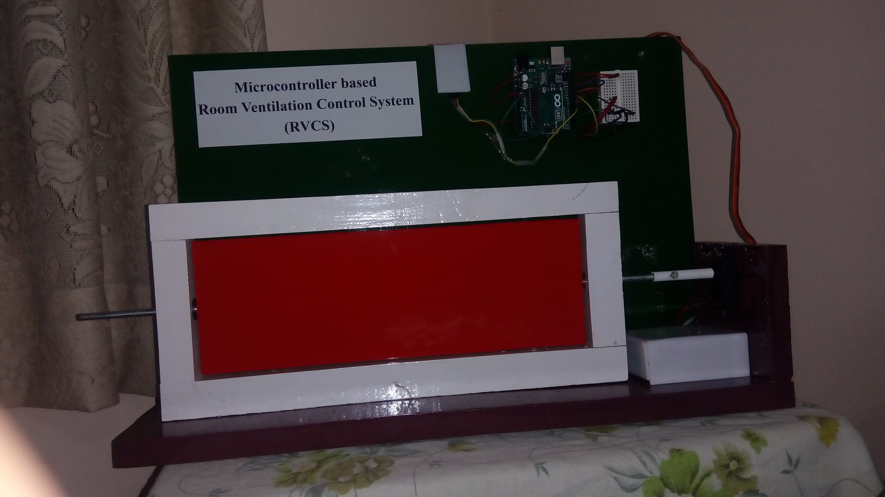

# RVCS
A microcontroller based Room Ventilation Control System, which uses a signal from a remote control to dynamically close and open ventilators, thereby eliminating the permanent closing of ventilators while installation of air conditioners or room heaters.
 
 
 
## Hardware Setup
 

